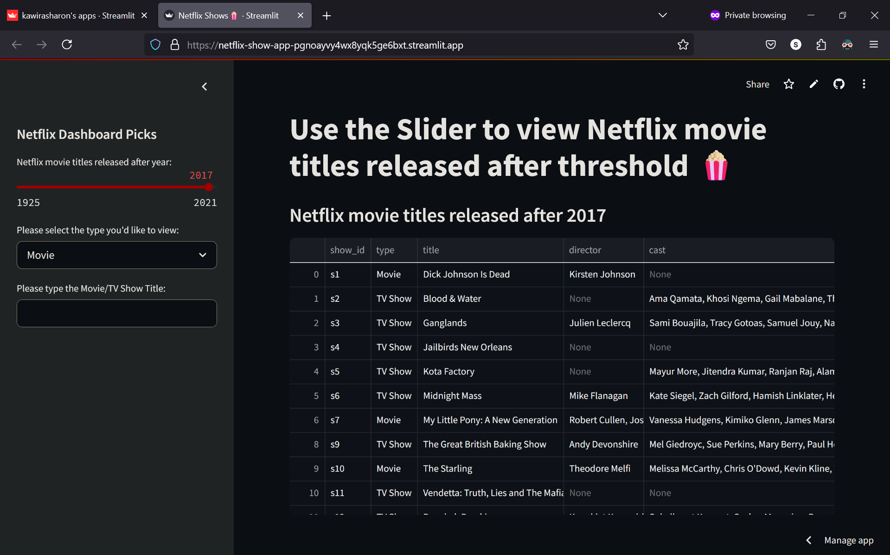
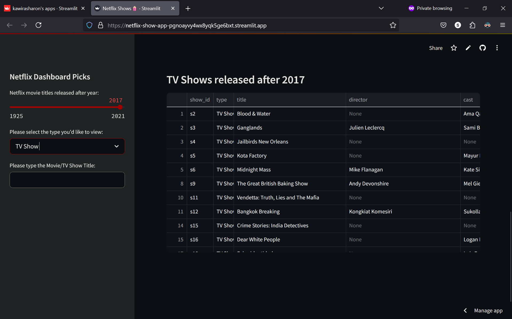
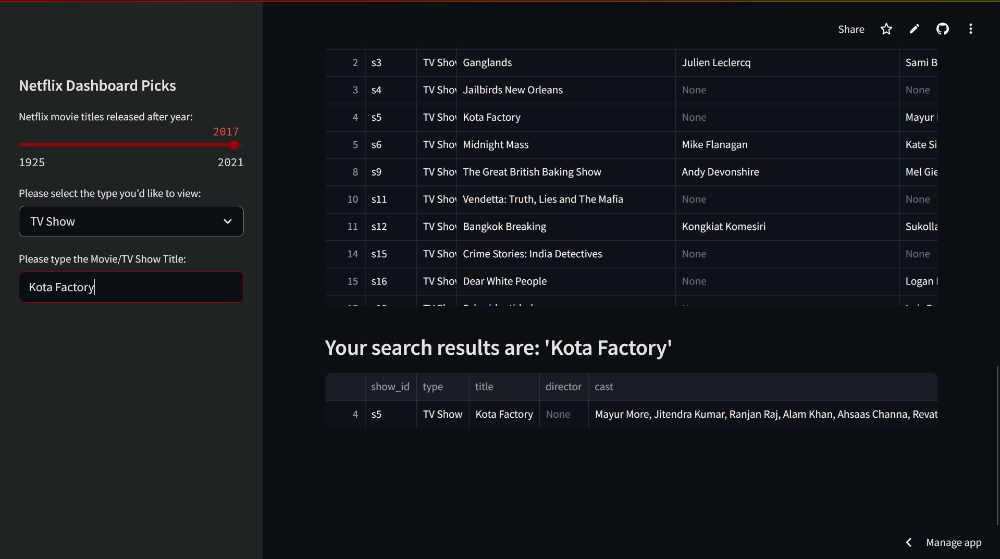
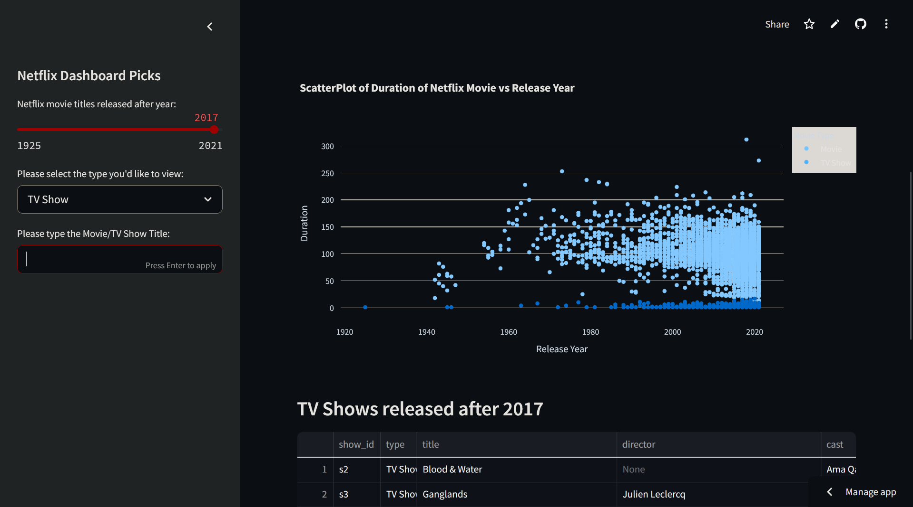

# Netflix Show App 🍿

This app uses Streamlit's capabilities to explore Netflix titles.

## Features
- Use a slider to filter Netflix titles by release year.
- Performs another filter returning either Movie/TV Show.
- Allows user input to search for TV Show/Movie by title.
- Displays a scatter plot of release year vs. duration providing insights.

This application used a real-time dataset from kaggle, view here:
[Netflix Movies and TV Shows since 1925](https://www.kaggle.com/datasets/shivamb/netflix-shows)

View and interact with the app here for a live demo:
[Netflix Interactive App](https://netflix-show-app-pgnoayvy4wx8yqk5ge6bxt.streamlit.app/)


## Screenshots
| Dashboard & Slider | Filter by TV Show/Movie | Filter by Searching for Title | Scatterplot|
|--------------------|-------------------------|-------------------------------|--------------|
 |  |  | 

## To Run Locally
```bash
python streamlit -m run app.py

Made by [@KawiraSharon](https://github.com/KawiraSharon)